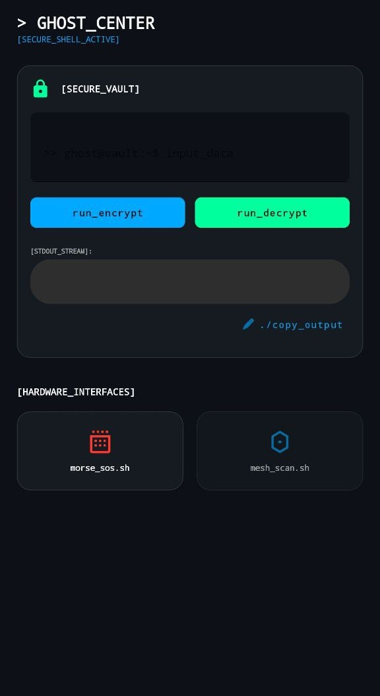
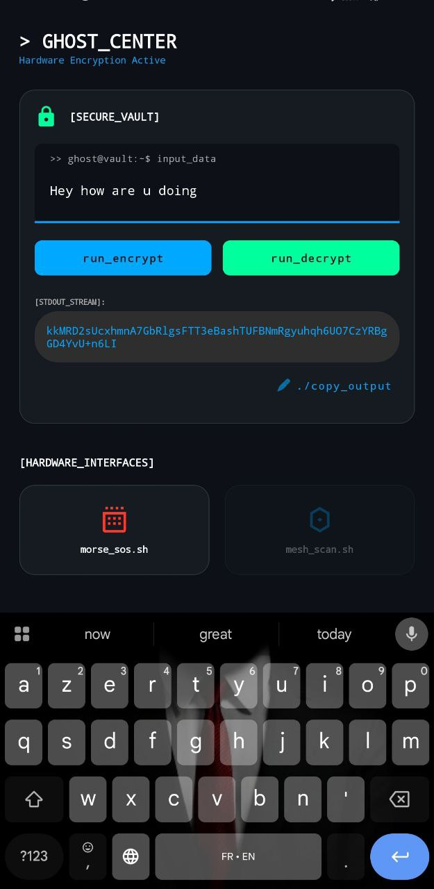
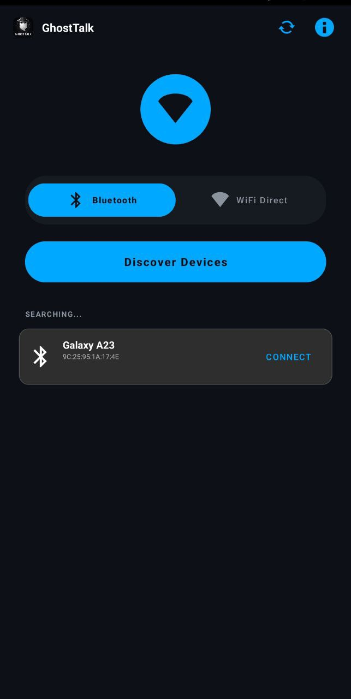
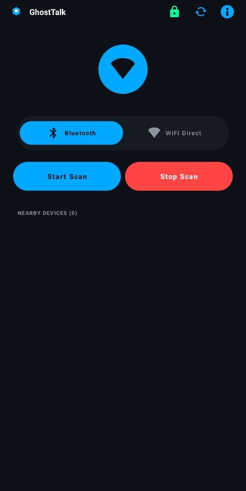
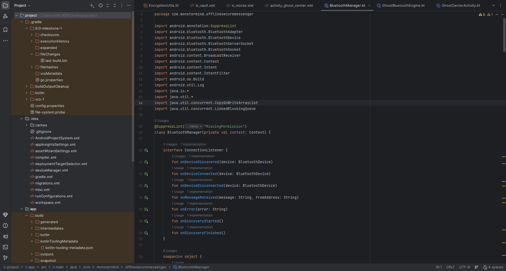
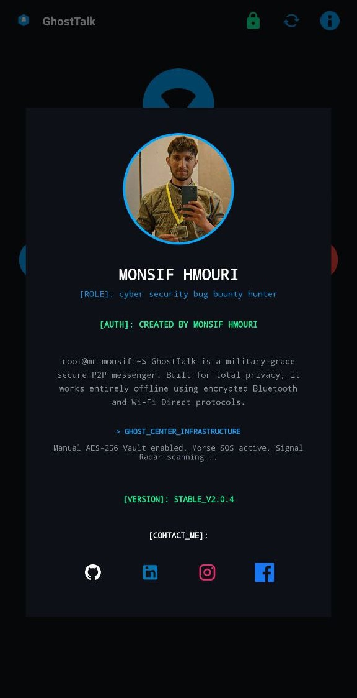

# GhostTalk

GhostTalk is a fully offline, peer-to-peer secure communication project designed and developed by **Monsif Hmouri**.  
The project focuses on direct device-to-device messaging without servers, cloud services, or internet routing, targeting environments where privacy, isolation, and control are mandatory.

GhostTalk is not a clone of existing messengers. It is an experimental architecture built from scratch to explore offline P2P communication, local encryption, and future mesh-based expansion.

---

## Project Overview

GhostTalk operates entirely without centralized infrastructure.  
All communication happens locally using Bluetooth and Wi-Fi Direct, with encryption handled inside the application itself.  
There is no account system, no phone number, no IP exposure, and no external dependency.

The project includes an internal security layer called **Ghost Center**, which provides manual encryption tools and hardware-assisted features.

---

## Core Features

- Offline peer-to-peer communication  
- Bluetooth device discovery and direct connection  
- Wi-Fi Direct support for higher bandwidth transfers  
- Manual AES-256 encryption and decryption vault  
- No servers, no internet routing, no metadata storage  
- Experimental mesh-node design for future expansion  
- Emergency signaling via Morse code (hardware level)

---

## Ghost Center – Secure Vault

Ghost Center is an internal security module designed to work independently from messaging.

It allows users to manually encrypt and decrypt text, copy secure output, and interact with low-level tools intended for secure environments.

  
  

---

## Device Discovery & P2P Communication

GhostTalk scans nearby devices using Bluetooth and allows direct encrypted connections without pairing through external services.

Each connected device acts as a local node.  
Future versions are designed to relay messages across multiple nodes.

  
  

---

## Development & Architecture

GhostTalk is written entirely in Kotlin and developed as a native Android application.

The networking layer uses low-level Bluetooth sockets and Wi-Fi P2P APIs, with concurrency handled through Kotlin threads and coroutines.

  

---

## Developer

**Monsif Hmouri**  
Cyber Security Researcher & Bug Bounty Hunter

GhostTalk is an independent research project created to explore offline communication, encryption logic, and decentralized networking on mobile devices.

The project reflects hands-on experimentation rather than theoretical design.

  

---

## Published Versions

This repository includes three released builds, each representing a different stage of development.

### GhostTalk v2.0.4
The latest and most complete version.  
Includes Ghost Center, improved P2P handling, and refined UI.

### GhostTalk v1.0
The original functional release.  
Represents the first working offline communication prototype.

### GhostTalk v1.0 (Alternate Build)
An experimental early build with structural differences.  
Kept for testing and architectural comparison.

---

## Project Status

GhostTalk is under active research and development.  
The architecture is evolving, and future versions may introduce extended mesh routing and hardware-assisted communication.
